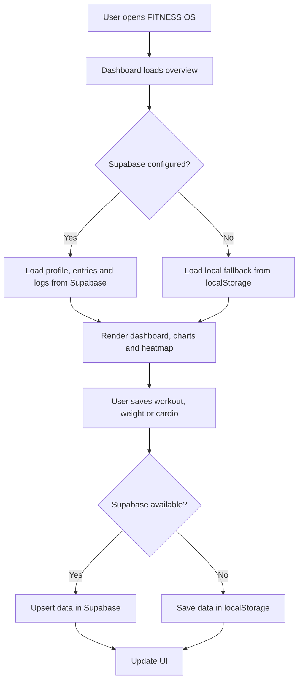
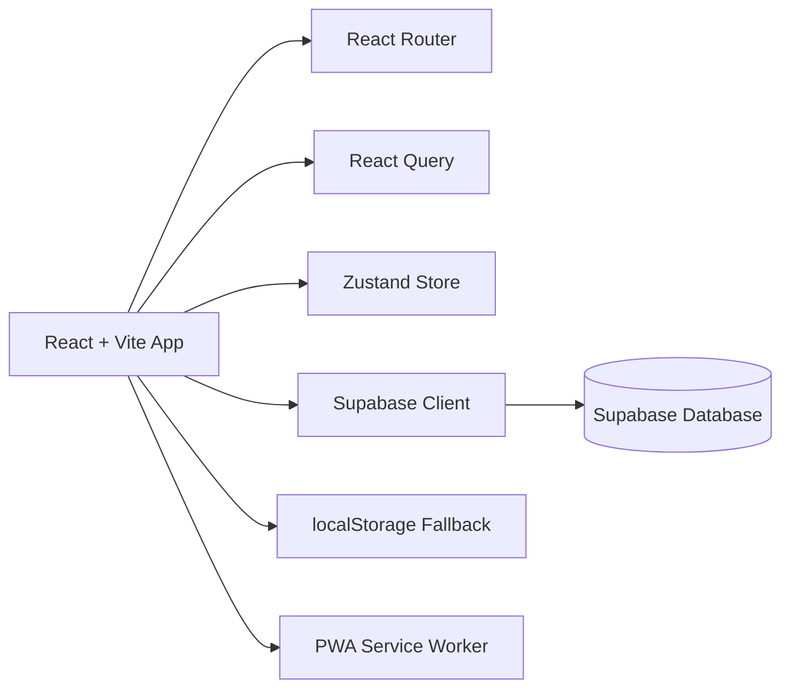

# 💪 FITNESS OS YKF

<h3 align="center">
  A personal fitness operating system for tracking workouts, body weight, cardio, training volume and consistency.
</h3>

<p align="center">
  <strong>Workout tracking · Body weight logs · Cardio records · GitHub-style heatmap · Charts · Timer · PWA · Supabase-ready</strong>
</p>

<p align="center">
  
  
  
  
  
  
</p>

---

## 📌 About the Project

**FITNESS OS YKF** is a personal fitness dashboard designed to track physical evolution in a simple, visual and consistent way.

The application focuses on daily training discipline: logging the workout of the day, recording exercise loads, tracking body weight, registering cardio sessions, visualizing progress through charts and maintaining a GitHub-style consistency calendar.

It works as a personal fitness operating system: one place to see what was trained, how much volume was moved, how body weight is changing and how consistent the user has been over time.

### 🇧🇷 Descrição em Português

O **FITNESS OS YKF** é um sistema pessoal para acompanhar treinos, cargas por exercício, peso corporal, cardio, volume semanal, calendário de consistência e evolução física em um dashboard visual, responsivo e instalável como app.

---

## 🎯 Project Goal

The goal of this project is to make fitness tracking practical and motivating.

Instead of using multiple notes, spreadsheets or disconnected apps, FITNESS OS centralizes the daily fitness routine in a single dashboard:

- What should I train today?
- Did I train today?
- How much weight did I lift?
- How much cardio did I do?
- How is my body weight evolving?
- How consistent have I been recently?
- What does my last year of consistency look like?

---

## ✨ Features

### Dashboard

- Today’s workout highlighted
- Quick body weight registration
- Quick cardio registration
- Current weight metric
- Saved workout count
- Current streak
- Best streak
- Weekly cardio summary
- Weekly training volume
- GitHub-style heatmap
- Weight evolution chart
- Training volume and cardio chart
- Daily detail modal

### Workout Tracking

- Weekly workout plan
- Exercises grouped by training day
- Sets, reps and rest time per exercise
- Load tracking in kilograms
- Total load calculation
- Workout minutes tracking
- Notes per day

### Weight Tracking

- Body weight registration by date
- Current weight metric
- Total weight loss calculation
- Weekly average loss
- Projected goal date
- Weight trend chart

### Cardio Tracking

- Cardio registration by date
- Cardio minutes tracking
- Separate cardio status
- Combined workout + cardio status
- Weekly cardio summary

### Calendar

- GitHub-style contribution heatmap
- Last 365 days view
- Visual distinction between empty days and saved days
- Day details modal
- Workout, cardio, rest and combined status support

### Timer

- Rest timer
- Free timer
- Pomodoro mode
- Preset rest times
- Start, pause and reset actions

### PWA

- Installable app behavior
- Web app manifest
- Service Worker registration
- Static asset caching
- Offline fallback to the app shell

---

## 🧠 How It Works



---

## 🏗️ Architecture



The project is a frontend application with optional Supabase persistence. When Supabase environment variables are not available, the app still works locally using `localStorage`.

---

## 🛠️ Tech Stack

### Core

| Technology | Usage |
|---|---|
| React 18 | UI rendering |
| Vite 6 | Development server and build tool |
| TypeScript | Type safety |
| React Router DOM 6 | Client-side routing |
| TanStack React Query 5 | Data loading and caching |
| Zustand | Lightweight client-side state |
| Supabase | Optional backend/database |
| React Hook Form | Form handling |
| Zod | Validation |
| Recharts | Charts and data visualization |
| Framer Motion | Page transitions and UI animation |
| Tailwind CSS | Styling |
| Lucide React | Icon library |
| date-fns | Date calculations |

### PWA / Platform

| Technology | Usage |
|---|---|
| Web App Manifest | Installable app metadata |
| Service Worker | Asset cache and offline fallback |
| localStorage | Development/offline fallback |
| Vercel | Suggested deployment platform |

---

## 📁 Project Structure

```bash
fitness-os-YKF/
├── public/
│   ├── icon.svg
│   ├── manifest.webmanifest
│   └── sw.js
├── src/
│   ├── app/
│   ├── components/
│   ├── constants/
│   ├── contexts/
│   ├── database/
│   ├── features/
│   ├── hooks/
│   ├── layouts/
│   ├── pages/
│   ├── services/
│   ├── stores/
│   ├── styles/
│   ├── types/
│   ├── utils/
│   └── main.tsx
├── package.json
└── README.md
```

---

## 📄 Main Files

| File | Description |
|---|---|
| `src/main.tsx` | Application entry point, React Query, router and PWA registration |
| `src/app/App.tsx` | App routes and layout structure |
| `src/layouts/AppLayout.tsx` | Sidebar, header, mobile navigation and “trained today” action |
| `src/pages/DashboardPage.tsx` | Main dashboard with workout, weight, cardio, metrics, heatmap and charts |
| `src/pages/CalendarPage.tsx` | Full consistency calendar |
| `src/pages/WorkoutsPage.tsx` | Weekly workout plan |
| `src/pages/WeightPage.tsx` | Weight metrics and projection |
| `src/pages/TimerPage.tsx` | Training timer |
| `src/services/fitness-storage.ts` | Supabase/localStorage data layer |
| `src/services/supabase.ts` | Supabase client configuration |
| `src/database/schema.sql` | Supabase database schema |
| `public/manifest.webmanifest` | PWA manifest |
| `public/sw.js` | Service Worker |

---

## ⚙️ Requirements

- Node.js `>= 20`
- npm
- Optional Supabase project
- Optional Vercel account for deployment

---

## ▶️ Running Locally

Install dependencies:

```bash
npm install
```

Run the development server:

```bash
npm run dev
```

Open:

```bash
http://127.0.0.1:5173
```

---

## 🧪 Available Scripts

```bash
npm run dev
```

Starts the Vite development server.

```bash
npm run build
```

Runs TypeScript build checks and creates the production build.

```bash
npm run preview
```

Serves the production build locally.

```bash
npm run lint
```

Runs TypeScript checks.

---

## 🔐 Environment Variables

The app works without Supabase using `localStorage`, but Supabase can be enabled with:

```bash
VITE_SUPABASE_URL=
VITE_SUPABASE_ANON_KEY=
```

When both variables are available, the app uses Supabase as the main persistence layer. When they are missing, the app uses local storage as a development fallback.

---

## 🗄️ Supabase Setup

1. Create a Supabase project.
2. Open the SQL Editor.
3. Run:

```bash
src/database/schema.sql
```

4. Add the environment variables to `.env.local` or Vercel:

```bash
VITE_SUPABASE_URL=your_supabase_url
VITE_SUPABASE_ANON_KEY=your_supabase_anon_key
```

5. Run or redeploy the app.

### Database Tables

| Table | Purpose |
|---|---|
| `profiles` | Stores profile and weight goal information |
| `daily_entries` | Stores workout/cardio/weight data by date |
| `exercise_logs` | Stores exercise sets, reps and load per day |

---

## 🧬 Data Model

### Profile

Stores personal fitness configuration:

- name
- start weight
- current weight
- goal weight
- start date

### Daily Entry

Stores daily training information:

- date
- status: `none`, `workout`, `cardio`, `both`, `rest`
- weight
- workout minutes
- cardio minutes
- total load
- notes

### Exercise Log

Stores exercise-level training data:

- exercise ID
- exercise name
- sets
- reps
- load in kilograms

---

## 📊 Dashboard Metrics

The dashboard calculates:

- current body weight
- total saved workouts
- current streak
- best streak
- saved cardio days
- weekly cardio minutes
- weekly workout minutes
- weekly training volume
- total load per workout day
- body weight trend
- projected weight goal date

---

## 🗓️ Weekly Workout Plan

The current weekly plan includes:

| Day | Focus |
|---|---|
| Monday | Chest + Shoulders + Triceps |
| Tuesday | Back + Biceps |
| Wednesday | Legs |
| Thursday | Full upper body |
| Friday | Legs + Core |
| Saturday | Cardio |
| Sunday | Rest |

The workout plan is currently defined in code and can be adapted over time.

---

## 📱 PWA Support

This project includes Progressive Web App support through:

- `manifest.webmanifest`
- standalone display mode
- custom app icon
- Service Worker registration
- static asset caching
- offline fallback to `index.html`

---

## 🚀 Deploy on Vercel

Recommended Vercel settings:

```txt
Install Command: npm install
Build Command: npm run build
Output Directory: dist
```

Environment variables on Vercel:

```txt
VITE_SUPABASE_URL=...
VITE_SUPABASE_ANON_KEY=...
```

---

## 🧪 QA Opportunities

This project is a strong candidate for manual QA practice because it has user flows, persistence, charts and date-based behavior.

Suggested test scenarios:

| Scenario | Expected Result |
|---|---|
| Open app without Supabase variables | App works using localStorage |
| Configure Supabase variables | App saves and loads data from Supabase |
| Click “Treinei hoje” | Today is marked as a workout day |
| Save body weight for a date | Weight chart updates |
| Save cardio for a date | Cardio metric and chart update |
| Save workout logs | Total load is calculated |
| Open a heatmap day | Detail modal shows saved data |
| Use timer in rest mode | Timer counts down |
| Use timer in free mode | Timer counts up |
| Install PWA | App opens in standalone mode |
| Refresh app after saving data | Saved data persists |

---

## 🧭 Roadmap / Future Improvements

- [ ] Add real screenshots to this README
- [ ] Add a live demo link
- [ ] Add `.env.example`
- [ ] Add editable workout plan
- [ ] Add exercise creation/editing
- [ ] Add multiple profiles/users
- [ ] Add Supabase Auth
- [ ] Add Row Level Security policies
- [ ] Add backup/export to CSV
- [ ] Add import from spreadsheet
- [ ] Add progressive overload suggestions
- [ ] Add workout templates
- [ ] Add personal records page
- [ ] Add body measurement tracking
- [ ] Add photo progress tracking
- [ ] Add better timer alarm behavior
- [ ] Add E2E tests with Playwright
- [ ] Add unit tests for stats calculations
- [ ] Add GitHub Actions for build validation

---

## ⚠️ Notes

- This is a personal fitness tracker, not a medical application.
- The app currently supports one default profile.
- Supabase is optional; localStorage is used as fallback.
- If sensitive health data is stored in Supabase, privacy and RLS policies should be configured before real production use.
- The weekly workout plan is currently hardcoded and should become editable in a future version.

---

## 💡 What I Learned

This project helped practice:

- building a real personal dashboard
- creating a PWA with React and Vite
- managing fitness records by date
- designing a GitHub-style consistency heatmap
- calculating training volume
- displaying weight and training charts
- using Supabase as optional persistence
- creating a localStorage fallback
- structuring a responsive mobile-first interface
- designing a project around a real personal need

---

## 👨‍💻 Author

Developed by **Yruam Käffer de Faria**.
